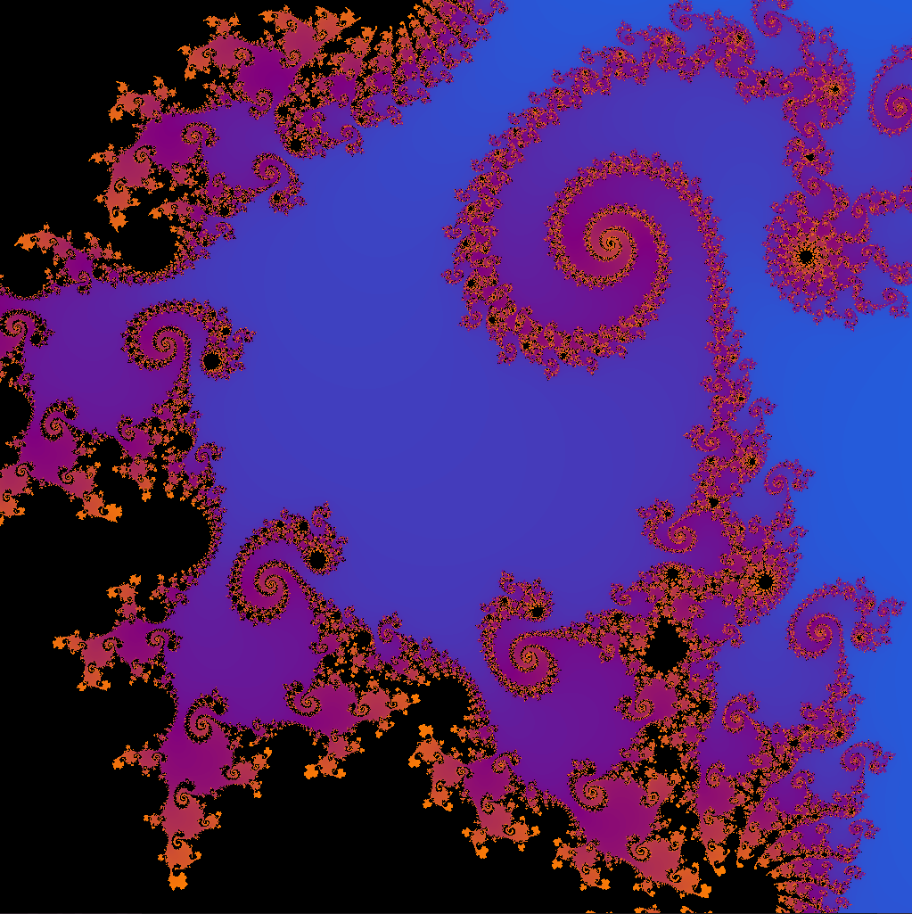

# Mandelbrot (GPU)

This is my basic GPU-based mandelbrot fractal renderer.
I wrote it to learn about OpenGL and compute shaders.

I also wanted to try optimising it as much as possible,
so I created a "demo" system to record inputs, which would
let me set up a uniform benchmark path with different zoom
levels, and different iteration counts.

It's still a rather bodged-together test program, so
don't expect a stellar interface, yet.

## How to use it

When you run `mandelbrot.exe`, a window should open showing
the titular fractal. You can pan around the image by clicking
and dragging around with the mouse, and you can zoom with
the scroll-wheel. If you hold shift while scrolling, you
will zoom in/out faster.

Apart from that, here are the other included controls:

 - **Escape:** Exits the program
 - **Keypad Plus:** Increments the number of iterations performed (increases detail, but is slower)
 - **Keypad Minus:** Decrements the number of iterations
 - **F5:** Prints the average framerate (FPS) over the last few frames
***Demo Controls:***
 - **F9:** Start/Stop Recording a 'demo' (Shift+F9 to delete previous demo and start over)
 - **F10:** Record current position/zoom to the current demo
 - **F11:** Play the current recorded demo
 - **Spacebar** Toggle pausing the currently playing demo
 - **F1:** Load the demo file `demo_file.bin` found in the same directory as `mandelbrot.exe`
 - **F2:** Save the current demo to the file `demo_file.bin` in the same directory as `mandelbrot.exe`
*(Don't worry, these controls are mainly intended just for testing, haha)*
